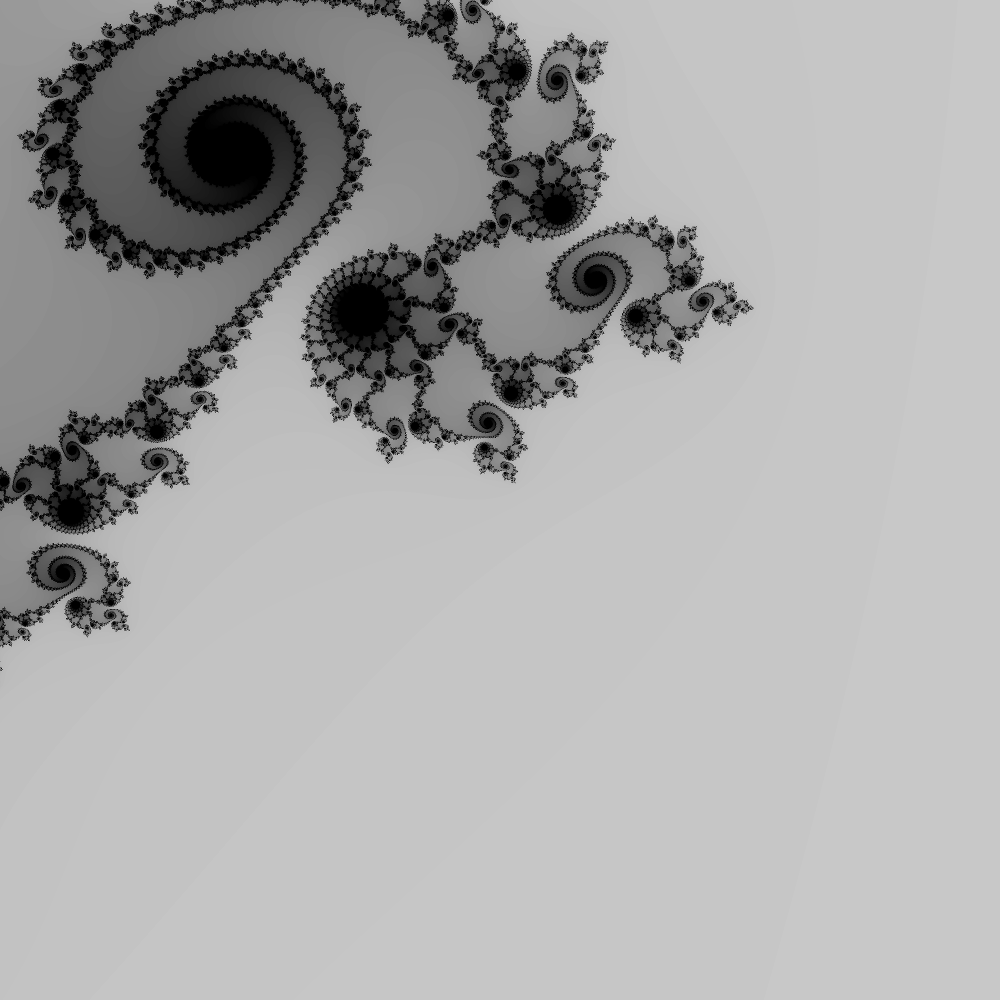
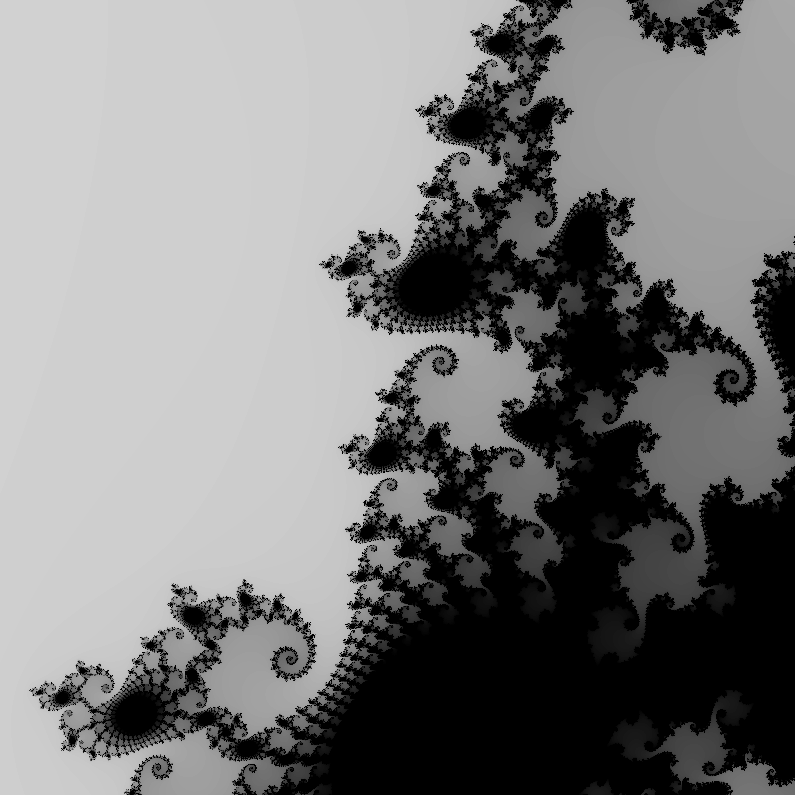

# mandelbrot set generation in haskell

This code renders the Mandelbrot Set. It generates images of the famous mathematical fractal for specified coordinates.

Configuration Parameters:

- `x_min`, `x_max`, `y_min`, and `y_max` specify the region of the complex plane to render.
- `width` and `height` determine the dimensions of the output image.

### usage

to render the .png for a set of coordinates, specify the coordinates in the `Mandel.hs` module. Then execute in bash:
```bash
cd src
make
./main
```

### requirements
 `JuicyPixels`
 - can be installed using `cabal install JuicyPixels`


### results

interesting images of the set using this renderer.




